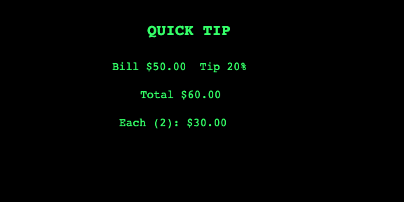
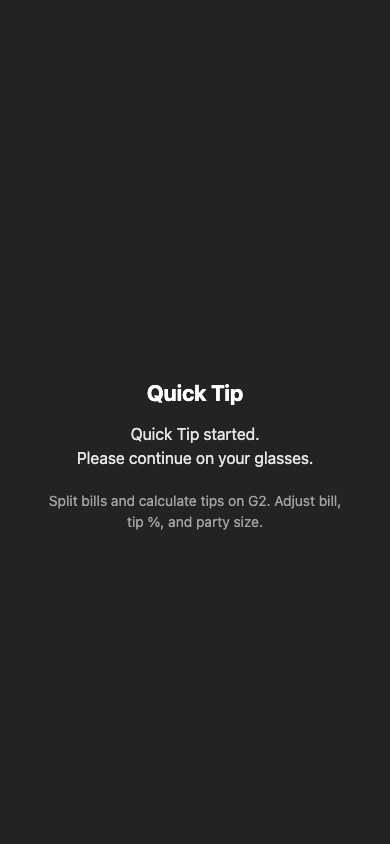

# Quick Tip — Even G2 Plugin

Tip calculator and bill splitter for Even Realities G2 glasses. Enter amount, pick tip %, split by party size — results on the HUD.

## Screenshots

| View | Preview |
|------|---------|
| [Cover](#) |  |
| [Title screen](#) |  |
| [Calculator](#) |  |
| [Phone companion](#) |  |


## Run

Requires **Node.js 20+**.

### Linux / macOS

```bash
git clone <your-repo-url>
cd quick-tip-g2
npm install
npm run dev
npm run simulate
npm run pack
```

### Windows

```powershell
git clone <your-repo-url>
cd quick-tip-g2
npm install
npm run dev
npm run simulate
npm run pack
```

See [SUBMISSION.md](SUBMISSION.md) for Even Hub upload details.
